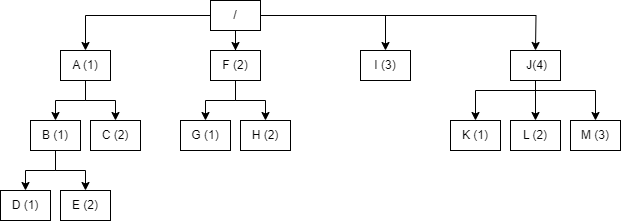

# Gorm hierarchyid
 - Library to handle hierarchyid type in SQL Server and go.
   - Generation and parsing of hierarchyid type in go.
   - Type wrapper for usage with gorm ORM.
 - The [hierarchyid](https://learn.microsoft.com/en-us/sql/relational-databases/hierarchical-data-sql-server?view=sql-server-ver16) is data to represent a position in a hierarchy in SQL Server.
   - It is a variable length type with reduced storage requirements.
 - Encodes the position in the hierarchy as a list of indexes
   - For example in the tree below the path to `E` is `/1/1/2/`
   - Indexes can be used to sort elements inside of a tree level.
 


## How it works
 - The `HierarchyID` is defined as a `[]int64` in go.
 - When serialized into JSON a textual representation is used for readability.
   - Represented as list separated by `/`. (e.g. `/1/2/3/4/5/`)
 - Each element in the slice represents a level in the hierarchy.
 - An empty slice represents the root of the hierarchy.
   - Elements placed in the root should not use an empty list.
   - They should instead by represented by `/1/`, `/2/`, etc.

## Model definition
 - Declare `HierarchyID` type in your gorm model, there is no need to specify the DB data type.
 - Is is recommended to also mark the field as `unique` to avoid duplicates.
 - The library will handle the serialization and deserialization of the field to match the SQL Server `hierarchyid` type.
    ```go
    type Model struct {
        gorm.Model

        Path HierarchyID `gorm:"unique;not null;"`
    }
    ```

## Usage


## Resources
 - [adamil.net - How the SQL Server hierarchyid data type works (kind of)](http://www.adammil.net/blog/v100_how_the_SQL_Server_hierarchyid_data_type_works_kind_of_.html)
 - [hierarchyid data type method reference](https://learn.microsoft.com/en-us/sql/t-sql/data-types/hierarchyid-data-type-method-reference?view=sql-server-ver16&redirectedfrom=MSDN)
  - .NET Implementation ([Logic](https://github.com/dotMorten/Microsoft.SqlServer.Types/tree/main/src/Microsoft.SqlServer.Types/SqlHierarchy) + [Interface](https://github.com/dotMorten/Microsoft.SqlServer.Types/blob/main/src/Microsoft.SqlServer.Types/SqlHierarchyId.cs))

## License
 - The project is distributed using a MIT license. Available on the project repository.
